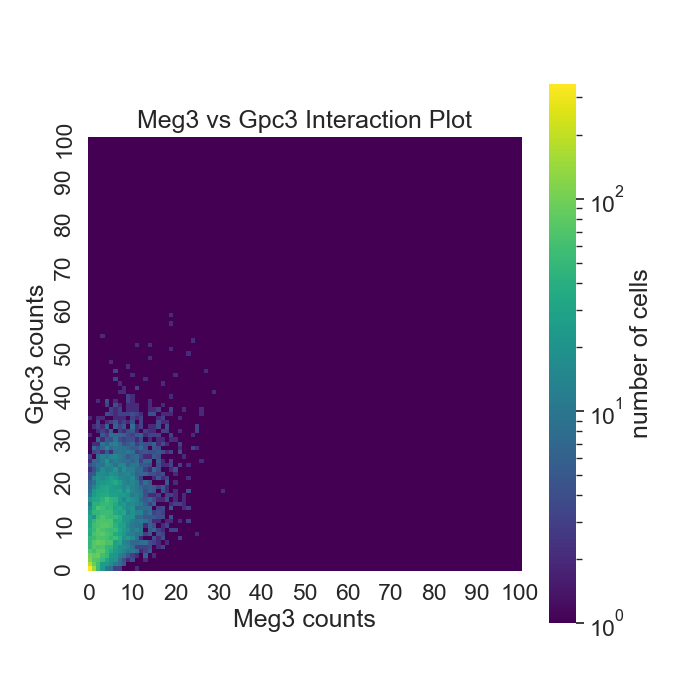
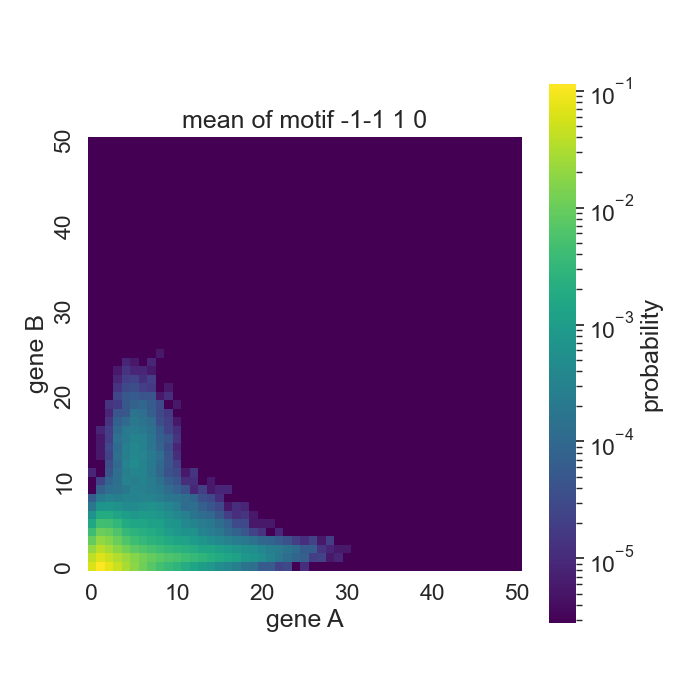

```{r setup, include=FALSE}
knitr::opts_chunk$set(echo = FALSE)
```


## Introduction and Problem Statement
Genes are fundamental to cell biology. Some gene may cause others to not be express, repress, some may cause them to be expressed more, activate, some may repress or activate themselves, or have no interaction with other genes. Key genes determine cell development. Considering many genes in a cell together, a (one-direction) network can model the interactions between the genes, where an edge may indicate activation or indicate repression. A large network of many genes is build up from network motifs between pairs of genes. Knowing these motifs, then, can inform modeling of large gene networks and and understanding cell development. The network links, however, not so clear that they can be observed directly. What can be observed is the number of gene A and gene B across many cells. These provide counts which may be transformed to estimate a bivariate probability mass function (pmf) for the two genes. The bivariate pmf is, in part, the result of the underlying motif. Predicting the motif based on the pmf may, therefore, be possible. The To this end, we used supervised machine learning to predict the motif given the pmf. This required that we know the underlining motif, so the Read Lab estimated the pmfs for the motifs using simulation. 

Prediction-modeling performance is pending.


## Background and related work
Describe relevant scientific background and point to work that tried to solve similar problems in the past. Provide a few references to textbooks and/or research articles that describe relevant background. 


Stochastic models of gene regulatory networks have been tremendously influential towards understanding cellular heterogeneity and analyzing data from single-cell RNA sequencing (scRNA-seq). In order to further understand single-cell gene pair interactions, stochastic models have been used to produce gene-pair co-expression landscapes from a bivariate distribution (Gallivan et al. (2020)). Gallivan et al. have developed a family of stochastic gene-gene interaction models because existing single-cell data analysis techniques have mostly disregarded that pair-wise gene interactions can be deduced from the shapes of these landscapes (2020). Shannon Entropy, Peason Correlation Coefficient, Mutual Information, and a Coexpression Index were found to be relatively inaccurate predictors of landscape shape of a gene-gene interaction on their own, so the student researchers added mean and standard deviation to the list of features to train the models (Gallivan et al. (2020)). 

In another relevant article, Cao, J., Spielmann, M., Qiu, X. et al. have used scRNA-seq on two million cells from mouse embryo in attempt to obtain a more comprehensive view of the mouse oranogenesis cell atlas (MOCA) and developmental processes (Cao, J., Spielmann, M., Qiu, X. et al. (2019)). The student researchers have used the data collected for this experiment to visualize the gene-pair bivariate pmfs used for the stochastic models and to test whether the models trained on the simulated data can distinguish the motif of a landscape. 


## Data and exploratory data analysis
Describe what data set(s) you used in the project – include references (e.g., URLs) for where you obtained the data if you can.  This section should have considerable detail – make sure you include a good description of your data set(s), including size, dimensionality, types of variables, etc. 
Use figures (histograms, scatter plots, etc) and tables, but do not overwhelm the reader with too many plots and show only plots that provide interesting insights. In your writing, try to give the reader some intuition and sense of what your data is like.

```{python}
import h5py
import pandas as pd
import numpy as np
from scipy.sparse import csr_matrix
import matplotlib.pyplot as plt
import seaborn as sns
from PIL import Image
import os
import sys
```


### Experimental Data

The data was transformed into a h5 file from https://oncoscape.v3.sttrcancer.org/atlas.gs.washington.edu.mouse.rna/downloads gene_count.txt.  

```{python warning = FALSE}

filename = '../data/hepatocyte_data.h5'

hdf = h5py.File(filename, mode = 'r')
# hdf.keys(): 'Hepatocyte trajectory'

d1 = hdf['Hepatocyte trajectory']

# d1.keys(): ['assay_data', 'col_labels', 'row_labels']

assay_data = d1['assay_data']
# assay_data.keys(): ['data', 'indices', 'indptr']

data = assay_data['data']
indices = assay_data['indices']
indptr = assay_data['indptr']

sparse = csr_matrix((data, indices, indptr))
sparse_size = sparse.shape
```

The rows of the sparse matrix are cells, and the columns are genes. The dataset is (11376, 26183), so there are 11376 cells and 26183 genes. The dataset from the h5 file has been transformed into a sparse matrix, but a sample of it is not shown here because it is mostly zeroes. Instead, the histogram below shows the distribution of values in the sparse matrix. The 2d plot was created from the entire sparse matrix and reinforces the idea that some genes are more commonly expressed than others. This is shown by the vertical striations seen in the graph for genes that are expressed in many cells. Other genes are seen as whitespace because they are hardly expressed at all.

```{python}
#fig, ax = plt.subplots(figsize=(10, 7))
#sns.histplot(csr_matrix.toarray().reshape(-1), bins=50)
#ax.set_yscale('log')
#plt.xlabel('probabilty')
#plt.show()
```


```{python results = 'hide'}
row_labels = d1['row_labels']

rows = np.array(row_labels)

df = pd.DataFrame.sparse.from_spmatrix(sparse)
num_cols = df.shape[1]

# series containing the number of cells that express the 
# corresponding gene
num_genes = pd.Series()

for gene, data in df.iteritems():
    cell_count = pd.Series((data != 0).sum())
    num_genes = num_genes.append(cell_count)

num_genes.index = [i for i in range(0, num_cols)]

# get top 26 most expressed gene
most_expressed = num_genes.nlargest(n = 26)

top_26_matrix = []

for gene, count in most_expressed.iteritems():
    top_26_matrix.append(df.loc[:, gene])

# rows: genes
# cols: cells
top_26_df = pd.DataFrame(top_26_matrix)
```

```{python}
print(top_26_df.head())
```


The top_26_df is a Dataframe of the 26 most expressed genes in the sparse matrix. There are 26 rows for the 26 genes and there are 11376 columns for the original amount of cells. This Dataframe was used to create gene-gene interaction heatmap plots for each distinct interaction between the 26 genes. The axis of the plots are the gene counts and the coloring scale represents the number of cells with the combination of gene counts. Below are two of the plots made.

From the afp vs meg3 plot, we can infer that cells that express a large amount of Afp also tend to express a large amount of Meg3. Therefore, we are expecting a motif identifier that expresses a fairly equal relationship between the two genes. The meg3 vs gpc3 plot shows that cells that express a large amount of Gpc3 tend to express a lower amount of Meg3, so we expect a motif identifer that favors one of the genes over the other. 




### Simulated Data
These data were generated by the Read Lab using the stochastic model which Gallivan et al. introduced (2019). We used multiple simulated data sets. The first we received (hereafter ) had pmf estimates for all 81 gene pair motifs, approximately 60 replicates, each using different rate parameters, per motif. The pmf's domain was two counts, starting at zero and truncated at fifty. This pmf was vectorized (length 2601). Each of the columns, then, has the estimated probability that a given cell would have that count of genes A and that count of gene B . For example, p(41,11) is the probability that a given cell would have 41 of gene A and 11 of gene B. We added to each row the motif identifier, which is four digits. The first digit identifies what gene A does to itself, the second what gene A does to gene B, the third what B does to A, and the fourth what B does to itself. Each digit may be 1 for activation, 0 for not interaction, or -1 for repression. Here is the first five rows of the data frame.

```{python Simulated Data Sample, echo=FALSE}
data_path = ['..', 'data']

x = [ i for i in range(51) for _ in range(51)]
y = [ i for _ in range(51) for i in range(51)]

columns = ['p(%d,%d)' % (i, j) for i, j in zip(x,y)]

data_1 = pd.read_table(os.path.join(*data_path, 'SyntheticData_FirstSet.txt'),
                       delimiter='   ',
                       names=columns,
                       dtype=float,
                       engine='python')

motif_labels = pd.read_table(os.path.join(*data_path, 'membership.txt'),
                             delimiter='   ',
                             names=['motif'],
                             dtype=int,
                             engine='python')


network_motifs = pd.read_table(os.path.join(*data_path, 'NetworkMotifs.txt'),
                             delimiter='  ',
                             names=['i0', 'i1', 'i2', 'i3'],
                             dtype=int,
                             engine='python')

network_motifs = pd.DataFrame(network_motifs.apply(lambda x: '{: d}{: d}{: d}{: d}'.format(*x), axis=1),
    columns=['id'])

network_motifs.index += 1

motif_labels = pd.merge(motif_labels.loc[:, 'motif'], network_motifs, how='left', left_on='motif', right_index=True)
data_1 = pd.merge(motif_labels, data_1, how='right', left_index=True, right_index=True)
```

```{python}
print(data_1.loc[:, 'id':'p(0,4)'].head())
```

The vector of probabilities for a row may be transformed to a 51x51 matrix and visualized using a heat map. Here are some examples:


```{python eval=FALSE, include=FALSE}
fig, ax = plt.subplots(figsize=(10, 7))
sns.histplot(data_1.loc[:, 'p(X=0,Y=0)':].to_numpy().reshape(-1), bins=50)
ax.set_yscale('log')
plt.title('Historgram of Probabilites')
plt.xlabel('probabilty')
plt.show()
```

The following are summary statistics of two motifs.




This motif varies quite a bit.


This motif is mutual repression, self activation.

## Methods
Provide a description of the technical/methodological approach that chose for your project. State assumptions clearly. 

We used several different machine learning methods for making predictions: multinomial logistic regression (ML), random forest (RF), and k nearest neighbors (KNN). 

ML is used to predict a categorical variable with 2 or more discrete outcomes. The ML breaks down the variable being predicted into many comparisons until it has a series of comparisons between two outcomes at a time. Assumptions of ML are that the data is linear, has no outliers, has independent observations, and predictors have little multicollinearity.  The models were fit on the synthetic data and not the experimental, so there aren't any outliers that can't be explained. However, the predictors do have multicollinearity because the columns/features are probabilities. In order to counteract this, either the l1 or l2 penalty was imposed on all ML models. 

RF uses an ensemble of decision trees. A decision tree splits the data using binary questions that maximize information gain for that split in the data. Once a tree is fit, prediction for a observation follow from which branches it follow in the tree. Using a single tree tends to result in over fitting and poor prediction on out of sample data. RF is one of the methods used for dealing the short-comings of decision trees. For RF, a individual tree is fitted to a sample, which has the same size as the training data and is sampled with replacement, from the training data. For each split in the tree, only a random selection of a specified proportion of the features are considered. Many trees trained on randoms samples using random selected features for each split are brought together to make a 'random forest'. When predicting with a RF, the predicted category is whatever category was predicted most frequently by the trees in the forest.

KNN is an algorithm that relies on the how close points are to each other for prediction. It works like this: To predict the class for a new point, find a specified number (k) of the closest points in euclidean space to that point; use the most frequent class among those neighbors to predict the class of the new point. In our implementation of KNN, we scaled the features using `standardscaler` from the SKLearn package to avoid giving certain features more weight in the prediction. We also used forward feature selection for in our best performing.

An assumption for all of these methods is that the data use to train and test them are representative. This assumption is not meet when considering the empirical data since the simulated data does not have sampling loss like the empirical does. Before doing prediction on empirical data these methods would need to be train and tested on data which adjusts for this, as well as other factors that may make the simulated data non-representative of the empirical.

As these methods, we also transformed the data into the following: the expected value of gene A (x_mean) and of gene B (y_mean), the standard deviation of A (x_sd) and of B (y_sd), the pearson correlation coefficient of A and B, the coexpression index of A and B (coexpress_index), the mutual information of A and B (mutual_info), the fano factor of A (x_fano) and of B (y_fano). Here is some of the transformed data:

```{python}
data_2m = pd.read_csv('../data/secondset_measures.csv')
print(data_2m.head())
```

## Results
Describe inferential and/or predictive results of your analysis. Try to avoid showing large tables and use graphics if possible instead. 

We assessed the methods by using five-fold cross-validation, both for accuracy and negative log loss (hereafter simply log loss). For accuracy, higher is better; for log loss, lower is better.

Our first set of results were better than random chance but not by much. We then used transformed features, reduced our number of outcomes, and used the second set of simulated data which gave more replicates per motif.


We use f(x) to denote transformed features, X the transformed, 2nd the second set of simulated data. 

As can be seen in the above graphs, decreasing the number of outcomes, transforming the features, and having more replicates per outcome resulted in the best outcomes for each methods. (Not all X's and y's were ran with KNN due to time constrains.) Here are the top five methods (by accuracy).

```{python}
results = pd.read_csv('../data/results.csv')
print(results.head(5))
```

When considering accuracy ML is performed the best, but when considering log loss RF performed the best. In practice, ML may be the better when interested in returning the predicted motif for a gene pair. If we want to consider, however, the probabilities of a gene pair being each motif, RF may want to be considered, as the log loss is a measure of how far off the probability was for the correct outcome.

ML model fit on second transformed data set confused motif 1-1-11 (mutual inhibition, self-activation) 20 times with 0100 (unidirectional activation) and confused motif 0110 (mutual activation) 23 times with 0100. In total, other motifs were confused with 0100 82 times. This could be because there are two possible ways to get unidirectional activation (0100 and 0010) with the model, but the model is only wrong about 124 times on average. 


## Discussion and Conclusion 
Discuss what insights you gained from your project, in bullet form as follows:
- Provide summary of your findings
- What are limitations of your analyses? How can they be remedied in the future work?

- ML model fit on second transformed data set (7 motifs/outcomes and about 500 replicates per motif) had the highest accuracy of 89%
- RF model fit on second transformed data set had lowest log loss of 0.2988
- All three models (ML, RF, KNN) fit on the second transformed data set were in the top five models when scoring accuracy and log loss respectively 
- Motifs in data sets with a reduced amount of outcomes tended to confuse motifs with unidirectional activation an unproportional amount of the time


- One limitation of our analyses is that our models could be used on the experimental data, but the underlying motifs would still be unknown. Without any other research being done on how the gene pairs in the experimental data set interact with each other, we have no way of evaluating the model on the experimental data. Being able to have a model that can predict motifs from gene counts in experimental data sets is the ultimate goal of this project.

## Works Cited

Cao, J., Spielmann, M., Qiu, X. et al. The single-cell transcriptional landscape of mammalian organogenesis. Nature 566, 496–502 (2019). https://doi.org/10.1038/s41586-019-0969-x

Gallivan CP, Ren H and Read EL (2020) Analysis of Single-Cell Gene Pair Coexpression Landscapes by Stochastic Kinetic Modeling Reveals Gene-Pair Interactions in Development. Front. Genet. 10:1387. doi: 10.3389/fgene.2019.01387


 
