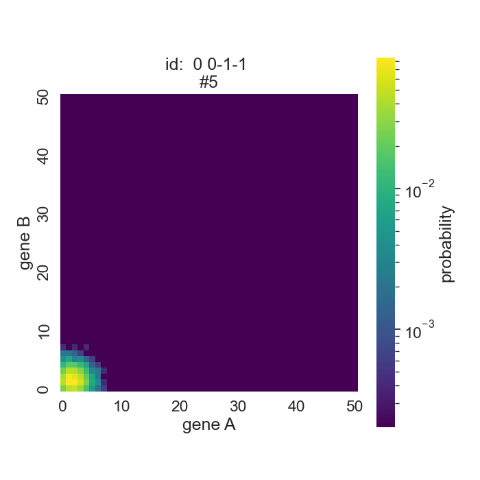

```{r setup, include=FALSE}
knitr::opts_chunk$set(echo = FALSE)
```


## Introduction and Problem Statement

Genes are fundamental to cell biology. Some gene may cause others to not be expressed or repressed, some may cause them to be expressed more, some activate other genes, some may repress or activate themselves, and others have no interaction with other genes. Key genes determine cell development. Considering many genes in a cell together, a network can model the interactions between the genes, where an edge may indicate activation, repression, or a null interaction. A large network of many genes is built up from network motifs between pairs of genes. Knowing these motifs, then, can inform modeling of large gene networks and the understanding of cell development. However, it is not so clear that the network links can be observed directly. What can be observed is the number of gene A and gene B across many cells. These provide counts which may be transformed to estimate a bivariate probability mass function (pmf) for the two genes. The bivariate pmf is, in part, the result of the underlying motif. Predicting the motif based on the pmf may, therefore, be possible. To this end, we used supervised machine learning to predict the motif given the pmf. This required that we know the underlining motif, so the Read Lab estimated the pmfs using simulation under known conditions, such as motif and rate parameters. 


## Background and related work

Gene regulatory network (GRN) inference has been and remains a difficult problem. Contributing to the challenge is that single cell RNA-seq may not provide gene counts with sufficient accuracy for inferring GRNs. They give a sample of the amount of genes, but depending on the technology, sc RNA-seq can only detect about 10% of all RNA molecules actually present (Zheng, Y., Zhong, Y., Hu, J. et al.). Thus, sc RNA-seq captures only a limited amount of data.

Stochastic models of gene regulatory networks have been tremendously influential towards understanding cellular heterogeneity and analyzing data from single-cell RNA sequencing (scRNA-seq). In order to further understand single-cell gene pair interactions, stochastic models have been used to produce gene-pair co-expression landscapes from a bivariate distribution (Gallivan et al. (2020)). Gallivan et al. have developed a family of stochastic gene-gene interaction models because existing single-cell data analysis techniques have mostly disregarded that pair-wise gene interactions can be deduced from the shapes of these landscapes (2020). Shannon Entropy, Peason Correlation Coefficient, Mutual Information, and a Coexpression Index were found to be relatively inaccurate predictors of landscape shape of a gene-gene interaction on their own, so the student researchers added mean and standard deviation to the list of features to train the models (Gallivan et al. (2020)). 

In another relevant article, Cao, J., Spielmann, M., Qiu, X. et al. have used scRNA-seq on two million cells from mouse embryo in attempt to obtain a more comprehensive view of the mouse oranogenesis cell atlas (MOCA) and developmental processes (Cao, J., Spielmann, M., Qiu, X. et al. (2019)). The student researchers have used the data collected for this experiment to visualize the gene-pair bivariate pmfs used for the stochastic models and to test whether the models trained on the simulated data can distinguish the motif of a landscape. 

Pratapa, A., Jalihal, A.P., Law, J.N. et al. have used partial information decomposition and context (PIDC) to predict GRNs from experimental data sets. However, this project is only focused on gene pairs and not a network of pairs. Also, we used our models to predict motifs on simulated data because we have no way of evaluating the correctness of a model fit on the experimental data. Pratapa, A., Jalihal, A.P., Law, J.N. et al. has developed an evaluation framework called BEELINE to assess their algorithms and models, but this is outside of the scope of the project. However, being able to fit a model on data collected through sc RNA-seq and evaluate the model without knowing the underlying motifs beforehand is the ultimate goal of this work.


## Data and exploratory data analysis

```{python}
import h5py
import pandas as pd
import numpy as np
from scipy.sparse import csr_matrix
import matplotlib.pyplot as plt
import seaborn as sns
from PIL import Image
import os
import sys
```


### Experimental Data

The data was transformed into a h5 file from (https://oncoscape.v3.sttrcancer.org/atlas.gs.washington.edu.mouse.rna/downloads) gene_count.txt.  

```{python warning = FALSE}

filename = '../data/hepatocyte_data.h5'

hdf = h5py.File(filename, mode = 'r')
# hdf.keys(): 'Hepatocyte trajectory'

d1 = hdf['Hepatocyte trajectory']

# d1.keys(): ['assay_data', 'col_labels', 'row_labels']

assay_data = d1['assay_data']
# assay_data.keys(): ['data', 'indices', 'indptr']

data = assay_data['data']
indices = assay_data['indices']
indptr = assay_data['indptr']

sparse = csr_matrix((data, indices, indptr))
sparse_size = sparse.shape
```

The rows of the sparse matrix are cells, and the columns are genes. The data set is (11376, 26183), so there are 11376 cells and 26183 genes. The data set from the h5 file has been transformed into a sparse matrix, and the values in the sparse matrix are the amount of a gene found in a particular cell. A sample of the sparse matrix is not shown here because it is mostly zeroes. Instead, the histogram below shows the distribution of values in the sparse matrix. The 2d plot was created from the entire sparse matrix and reinforces the idea that some genes are more commonly expressed than others. This is shown by the vertical striations seen in the graph for genes that are expressed in many cells. Other genes are seen as white-space because they are hardly expressed at all.

```{python}
#fig, ax = plt.subplots(figsize=(10, 7))
#sns.histplot(csr_matrix.toarray().reshape(-1), bins=50)
#ax.set_yscale('log')
#plt.xlabel('probabilty')
#plt.show()
```


```{python}
top_26 = pd.read_csv('../data/top_26_df.csv')
print(top_26.head(5))
```

```{python}
shortened_genes = {23560:'Yam1', 7942:'Afp', 19548:'Meg3', 24692:'Malat1',
                   26165:'mt-Rnr2'}

for key, val in shortened_genes.items():
  print('Row index: ', key, '; gene name: ', val)
```


The top_26_df (shown above) is a data frame of the 26 most expressed genes in the sparse matrix. There are 26 rows for the 26 genes and there are 11376 columns for the original amount of cells. The first column contains the row index of the selected genes from the original experimental data frame, and shown above are the corresponding gene names for the first five genes. This data frame was used to create gene-gene interaction heatmap plots for each distinct interaction between the 26 genes. The axis of the plots are the gene counts and the coloring scale represents the number of cells with the combination of gene counts. Below are two of the plots made.

From the Afp vs Meg3 plot, we can infer that cells that express a large amount of Afp also tend to express a large amount of Meg3. Therefore, we are expecting a motif identifier that expresses a fairly equal relationship between the two genes. The Meg3 vs Gpc3 plot shows that cells that express a large amount of Gpc3 tend to express a lower amount of Meg3, so we expect a motif identifier that favors one of the genes over the other.  Compared to the gene-gene plots from the simulated data, the plots below tend to have more points that stray from the mean probability and the gene combination of (0, 0). This gives them a "smeared" look.


\newpage
### Simulated Data

These data were generated by the Read Lab using the stochastic model which Gallivan et al. introduced (2019). We used multiple simulated data sets. The first we received had pmf estimates for all 81 gene pair motifs with approximately 60 replicates, each using different rate parameters, per motif. The pmf's domain starts at zero and is truncated at fifty. This pmf was vectorized (length 2601). Each of the columns, then, has the estimated probability that a given cell would have that count of genes A and that count of gene B. For example, p(41,11) is the probability that a given cell would have 41 of gene A and 11 of gene B. We added the motif identifier to each row, which is four digits. The first digit identifies what gene A does to itself, the second is what gene A does to gene B, the third is what B does to A, and the fourth is what B does to itself. Each digit may be 1 for activation, 0 for no interaction, or -1 for repression. Here are the first five rows of the data frame.

```{python Simulated Data Sample, echo=FALSE}
data_path = ['..', 'data']

x = [ i for i in range(51) for _ in range(51)]
y = [ i for _ in range(51) for i in range(51)]

columns = ['p(%d,%d)' % (i, j) for i, j in zip(x,y)]

data_1 = pd.read_table(os.path.join(*data_path, 'SyntheticData_FirstSet.txt'),
                       delimiter='   ',
                       names=columns,
                       dtype=float,
                       engine='python')

motif_labels = pd.read_table(os.path.join(*data_path, 'membership.txt'),
                             delimiter='   ',
                             names=['motif'],
                             dtype=int,
                             engine='python')


network_motifs = pd.read_table(os.path.join(*data_path, 'NetworkMotifs.txt'),
                             delimiter='  ',
                             names=['i0', 'i1', 'i2', 'i3'],
                             dtype=int,
                             engine='python')

network_motifs = pd.DataFrame(network_motifs.apply(lambda x: '{: d}{: d}{: d}{: d}'.format(*x), axis=1),
    columns=['id'])

network_motifs.index += 1

motif_labels = pd.merge(motif_labels.loc[:, 'motif'], network_motifs, how='left', left_on='motif', right_index=True)
data_1 = pd.merge(motif_labels, data_1, how='right', left_index=True, right_index=True)
```

```{python}
print(data_1.loc[:, 'id':'p(0,4)'].head())
```

The vector of probabilities for a row may be transformed to a 51x51 matrix and visualized using a heat map. The axis are the counts of gene A and gene B while the color scale is the probability of a cell having that combination of gene A and gene B. Here are some examples:





```{python eval=FALSE, include=FALSE}
fig, ax = plt.subplots(figsize=(10, 7))
sns.histplot(data_1.loc[:, 'p(X=0,Y=0)':].to_numpy().reshape(-1), bins=50)
ax.set_yscale('log')
plt.title('Historgram of Probabilites')
plt.xlabel('probabilty')
plt.show()
```

The following are summary statistics of two motifs.


This motif varies quite a bit.


This motif is mutual repression, self activation.

\newpage
The second simulated data set was created from data sets of seven motifs with about 500 replicates each. The columns are still the estimated probability that a given cell would have that count of genes A and that count of gene B, but the probabilities are not ordered like they are in the first data set. Order of the probabilities does not matter in this data set because unlike the first data set, not all replicates were vectors of the same size. The rows are the replicates, and the first value of each row is the motif number that the replicate belongs to. Below is the first five rows of the data frame:

```{python}
secondset = pd.read_csv('../data/secondset-prob-df.csv')
print(secondset.head(5))
```

Below are some of the heatmaps for the second data set.


Mutual inhibition, self activation tends to have more count combinations with high probabilities because there are rate parameters for all four interactions. The noise you see is from the sampling.


Below are summary statistics for two motifs.


The mean varies quite a bit because rate parameters control all four interactions (interactions are not 0).


\newpage
## Methods

We used several different machine learning methods for making predictions: multinomial logistic regression (ML), random forest (RF), and k nearest neighbors (KNN). 

ML is used to predict a categorical variable with 2 or more discrete outcomes. The ML breaks down the variable being predicted into many comparisons until it has a series of comparisons between two outcomes at a time. Assumptions of ML are that the data is linear, has no outliers, has independent observations, and predictors have little multicollinearity.  The models were fit on the synthetic data and not the experimental, so there aren't any outliers that can't be explained. However, the predictors do have multicollinearity because the columns/features are probabilities. In order to counteract this, either the l1 or l2 penalty was imposed on all ML models. 

RF uses an ensemble of decision trees. A decision tree splits the data using binary questions that maximize information gain for that split in the data. Once a tree is fit, a prediction for a replicate is made by following questions down the tree branches until it reaches the bottom. Using a single tree tends to result in over-fitting and poor predictions on the sample data. RF is one of the methods used for dealing with the short-comings of decision trees. For RF, an individual tree is fitted to a sample, which has the same size as the training data and is sampled with replacement, from the training data. For each split in the tree, only a random selection of a specified proportion of the features are considered. Many trees trained on randoms samples using random selected features for each split are brought together to make a 'random forest'. When predicting with a RF, the predicted category is whichever category was predicted most frequently by the trees in the forest.

KNN is an algorithm that relies on the how close points are to each other for prediction. It works like this: to predict the class for a new point, find a specified number (k) of the closest points in euclidean space to that point; use the most frequent class among those neighbors to predict the class of the new point. In our implementation of KNN, we scaled the features using `standardscaler` from the SKLearn package to avoid giving certain features more weight in the prediction. We used forward feature selection in our best performing model.

An assumption for all of these methods is that the data used to train and test them are representative. This assumption is not met when considering the empirical data since the simulated data does not have sampling loss like the empirical does. Before doing prediction on empirical data, these methods would need to be trained and tested on data which adjusts for this, as well as other factors that may make the simulated data non-representative of the empirical.

We also transformed the data into the following: the expected value of gene A (x_mean) and of gene B (y_mean), the standard deviation of A (x_sd) and of B (y_sd), the pearson correlation coefficient of A and B, the coexpression index of A and B (coexpress_index), the entropy of A and B (entropy), the mutual information of A and B (mutual_info), and the fano factor of A (x_fano) and of B (y_fano). Here is rows of the transformed data:

```{python}
data_2m = pd.read_csv('../data/secondset_measures.csv')
print(data_2m.head(5))
```

## Results

We assessed the methods by using five-fold cross-validation, both for accuracy and negative log loss (hereafter simply log loss). For accuracy, higher is better; for log loss, lower is better.

Our first set of results were better than random chance, but not by much. We then used transformed features, reduced our number of outcomes, and used the second set of simulated data which gave more replicates per motif.


We use f(x) to denote transformed features, X the transformed, 2nd the second set of simulated data. 

As can be seen in the above graphs, decreasing the number of outcomes, transforming the features, and having more replicates per outcome resulted in the best outcomes for each of the methods. (Not all X's and y's were ran with KNN due to time constrains.) Here are the top five methods (by accuracy).

```{python}
results = pd.read_csv('../data/results.csv')
print(results.head(5))
```

When considering accuracy, ML performed the best, but when considering log loss, RF performed the best. In practice, ML may be the better when interested in returning the predicted motif for a gene pair. If we want to consider, however, the probabilities of a gene pair being each motif, RF may want to be considered, as the log loss is a measure of how far off the probability was for the correct outcome.

ML model fit on the second transformed data set, transformed features for the data set with seven motifs and about 500 replicates each, confused replicates from motif 1-1-11 (mutual inhibition, self-activation) 20 times with 0100 (unidirectional activation) and confused replicates from motif 0110 (mutual activation) 23 times with 0100. In total, other motifs were confused with 0100 82 times. This could be because there are two possible ways to get unidirectional activation (0100 and 0010) with the model, but the model is only wrong about 124 times on average for each testing group. Another reason could be that the replicates of 1-1-11 and 0110 that were confused with the unidirectional activation motifs had rate combinations that made the pmfs look like the pmfs from unidirectional activation.


## Discussion and Conclusion 


### Summary

- ML model fit on second transformed data set (7 motifs/outcomes and about 500 replicates per motif) had the highest accuracy of 89%
- RF model fit on second transformed data set had lowest log loss of 0.2988
- All three models (ML, RF, KNN) fit on the second transformed data set were in the top five models when scoring accuracy and log loss respectively 
- Motifs in data sets with a reduced amount of outcomes tended to confuse motifs with unidirectional activation an unproportional amount of the time

### Limitations

- One limitation of our analyses is that our models could be used on the experimental data, but the underlying motifs would still be unknown. Without any other research being done on how the gene pairs in the experimental data set interact with each other, we have no way of evaluating the model on the experimental data. Being able to have a model that can predict motifs from gene counts in experimental data sets is the ultimate goal of this project.

\newpage
## Works Cited

Cao, J., Spielmann, M., Qiu, X. et al. The single-cell transcriptional landscape of mammalian organogenesis. Nature 566, 496–502 (2019). https://doi.org/10.1038/s41586-019-0969-x

Gallivan CP, Ren H and Read EL (2020) Analysis of Single-Cell Gene Pair Coexpression Landscapes by Stochastic Kinetic Modeling Reveals Gene-Pair Interactions in Development. Front. Genet. 10:1387. doi: 10.3389/fgene.2019.01387

Pratapa, A., Jalihal, A.P., Law, J.N. et al. Benchmarking algorithms for gene regulatory network inference from single-cell transcriptomic data. Nat Methods 17, 147–154 (2020). https://doi.org/10.1038/s41592-019-0690-6

Zheng, Y., Zhong, Y., Hu, J. et al. SCC: an accurate imputation method for scRNA-seq dropouts based on a mixture model. BMC Bioinformatics 22, 5 (2021). https://doi.org/10.1186/s12859-020-03878-8


 
